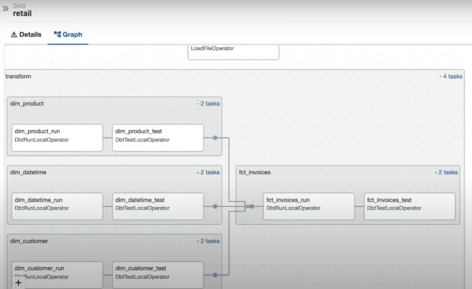

# DBT Transform
## Install Cosmos - DBT
Cosmos: https://github.com/astronomer/astronomer-cosmos
- Run dbt projects against Airflow connections instead of dbt profiles
- Native support for installing and running dbt in a virtual environment to avoid dependency conflicts with Airflow
- Run tests immediately after a model is done to catch issues early
- Utilize Airflow's data-aware scheduling to run models immediately after upstream ingestion
- Turn each dbt model into a task/task group complete with retries, alerting, etc.

In requirements.txt: 
```
// REMOVE apache-airflow-providers-google==10.3.0 // since google will be installed along with cosmos
// REMOVE soda-core-bigquery==3.0.45
astronomer-cosmos[dbt-bigquery]==1.0.3 // install google + cosmos + dbt // since we want to interact with bigquery
protobuf==3.20.0 # for compatibility issues
```

In env (required because of conflicts):
```
PROTOCOL_BUFFERS_PYTHON_IMPLEMENTATION=python
```

In Dockerfile: install dbt into a virtual environment
```
RUN python -m venv dbt_venv && source dbt_venv/bin/activate && \
    pip install --no-cache-dir dbt-bigquery==1.5.3 && deactivate
```

Restart: `astro dev restart`

## Configuration
In include/dbt/profiles.yml: the profiles to connect dbt to bigquery
```
retail:
 target: dev
 outputs:
  dev:
    type: bigquery
    method: service-account
    keyfile: /usr/local/airflow/include/gcp/service_account.json # use service account to connect to bigquery
    project: airflow-toturial-394608
    dataset: retail
    threads: 1
    timeout_seconds: 300
    location: US # go to bigquery table -> dataset info 
```


dbt/dbt_project.yml: describe the dbt project
- model is on a file with the sql request to transform your data
```
name: 'retail'

profile: 'retail'

models:
  retail:
    materialized: table
```

dbt/packages.yml: install dependencies dbt
```
packages:
  - package: dbt-labs/dbt_utils
    version: 1.1.1
```


In dbt/models/sources: sources.yml is to specify the tables from which transformations will use the data, country doesn't exist yet which needs to be created
```
version: 2

sources:
  - name: retail
    database: airtube-390719 # Put the project id!

    tables:
      - name: raw_invoices
      - name: country
```

Create country table: go to Bigquery -> Execute the retail.country SQL request

## Create tables
In dbt/models/transform/:
- dim_customer.sql
- dim_datetime.sql
- dim_product.sql
- fct_invoices.sql

In terminal: 
```
astro dev bash
source dbt_venv/bin/activate # go to dbt env
cd user/local/airflow/include/dbt
dbt depts # to install dbt dependencies in dbt utils
dbt run --profile-dir /usr/local/airflow/include/dbt
```

Go to bigquery UI: there're 4 new tables created

## Integrate dbt into data pipeline by using Cosmos
In dbt/cosmos_config.py:
```
# include/dbt/cosmos_config.py

from cosmos.config import ProfileConfig, ProjectConfig
from pathlib import Path

DBT_CONFIG = ProfileConfig( # what profile we want to use
    profile_name='retail',
    target_name='dev',
    profiles_yml_filepath=Path('/usr/local/airflow/include/dbt/profiles.yml')
)

DBT_PROJECT_CONFIG = ProjectConfig( # where the dbt profile is
    dbt_project_path='/usr/local/airflow/include/dbt/',
)
```

In dags/retail.py: add dbt tasks
```
from include.dbt.cosmos_config import DBT_PROJECT_CONFIG, DBT_CONFIG
from cosmos.airflow.task_group import DbtTaskGroup
from cosmos.constants import LoadMode
from cosmos.config import ProjectConfig, RenderConfig

transform = DbtTaskGroup(
        group_id='transform',
        project_config=DBT_PROJECT_CONFIG,
        profile_config=DBT_CONFIG,
        render_config=RenderConfig(
            load_method=LoadMode.DBT_LS,
            select=['path:models/transform']
        ))
```

Test tasks:
```
astro dev bash
airflow tasks list retail
airflow tasks test retail transform.dim_customer.dim_customer_run 2023-01-01
airflow tasks test retail transform.dim_customer.dim_customer_test 2023-01-01
```



